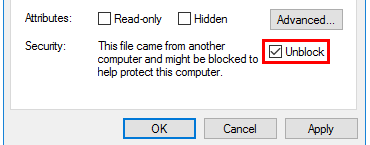
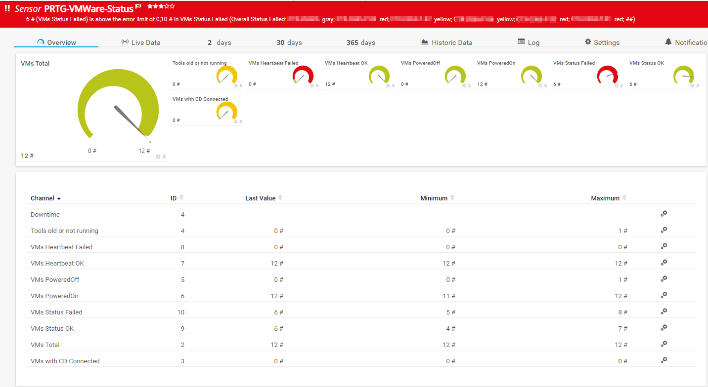

# PRTG-VMWare-Status

<!-- ABOUT THE PROJECT -->
### About The Project
Project Owner: Jannos-443

PRTG Powershell Script to monitor vmware vm status

Using VMWare PowerCLI this Script checks VMware VM Status for example VMware Tools, Heartbeat, CDDrive Connected and Overall State

Free and open source: [MIT License](https://github.com/Jannos-443/PRTG-VMware-Status/blob/main/LICENSE)

**Features**
* Monitor VM Status
* Monitor VM Heartbeats
* Monitor VM Tools
* Monitor VM CD Connected
* Monitor StoragePaths
* Excludes/Includes
  * ExcludeVMName
  * ExcludeFolder
  * ExcludeRessource
  * ExcludeVMHost
  * IncludeVMName
  * IncludeFolder
  * IncludeRessource
  * IncludeVMHost

<!-- GETTING STARTED -->
## Getting Started

1. Make sure the VMware PowerCLI Module exists on the Probe under the Powershell Module Path
   - `C:\Program Files\WindowsPowerShell\Modules\VMware.VimAutomation.Core`

2. Place `PRTG-VMware-Snapshot-Status.ps1` under `C:\Program Files (x86)\PRTG Network Monitor\Custom Sensors\EXEXML`

3. check if file needs to be unblocked
    - `Unblock-File C:\Scripts\Script.ps1` 
      

4. Create new Sensor

   | Settings | Value |
   | --- | --- |
   | EXE/Script Advanced | PRTG-VMware-Status.ps1 |
   | Parameters | -ViServer 'yourVCenterFQDN' -User 'yourUser' -Password 'yourPassword' |
   | Scanning Interval | 10 minutes |


4. Change parameter if needed 
   - Include/Exclude
   - Change Limits

## Usage

```powershell
-ViServer 'yourVCenterFQDN' -User 'yourUser' -Password 'yourPassword'
```
Monitor all VMs with all categories

```powershell
-ViServer 'yourVCenterFQDN' -User 'yourUser' -Password 'yourPassword' -ExcludeVMName '^(TEST.*)$'
```
Monitor all VMs with all categories but excludes all VMs starting with "TEST"

```powershell
-ViServer 'yourVCenterFQDN' -User 'yourUser' -Password 'yourPassword' -ExcludeVM_VMTools '^(APPLIANCE1)$'
```
Monitor all VMs with all categories but excludes "APPLIANCE1" from VMware Tools monitoring

```powershell
-ViServer 'yourVCenterFQDN' -User 'yourUser' -Password 'yourPassword' -HideVMTools
```
Monitor all VMs with but without the "VMwareTool" monitoring

## Examples



## Includes/Excludes

You can use the variables to exclude/include VM(s)/Snapshots(s) 
The variables take a regular expression as input to provide maximum flexibility.

For more information about regular expressions in PowerShell, visit [Microsoft Docs](https://docs.microsoft.com/en-us/powershell/module/microsoft.powershell.core/about/about_regular_expressions).

".+" is one or more charakters
".*" is zero or more charakters